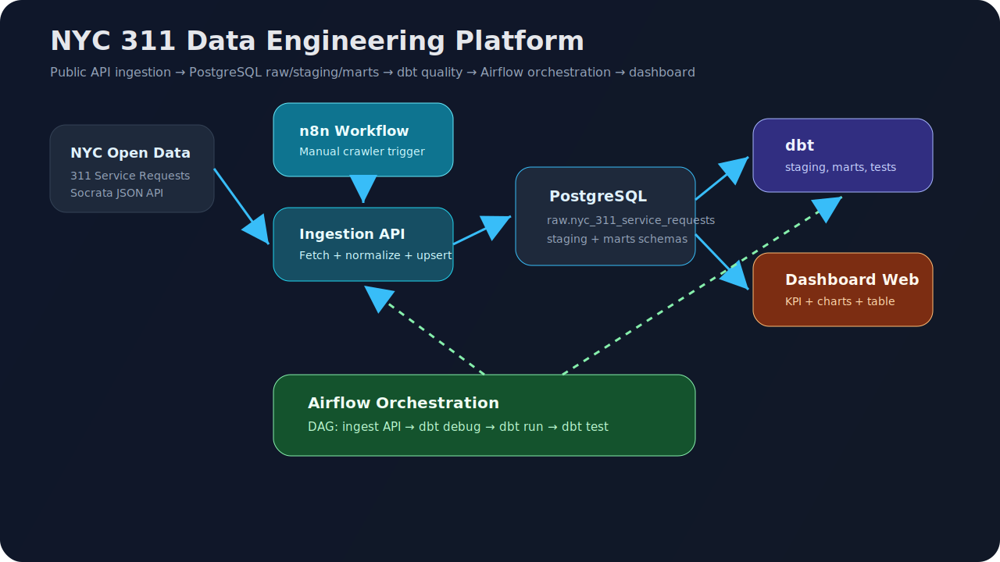
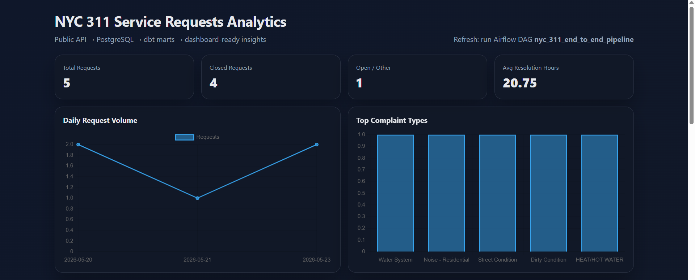
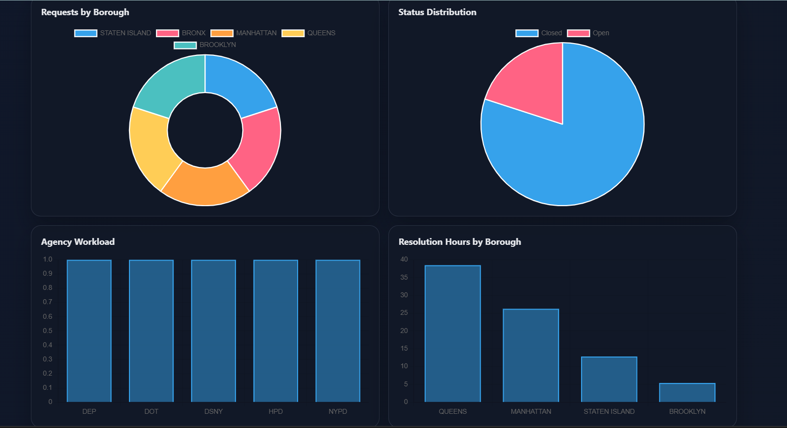
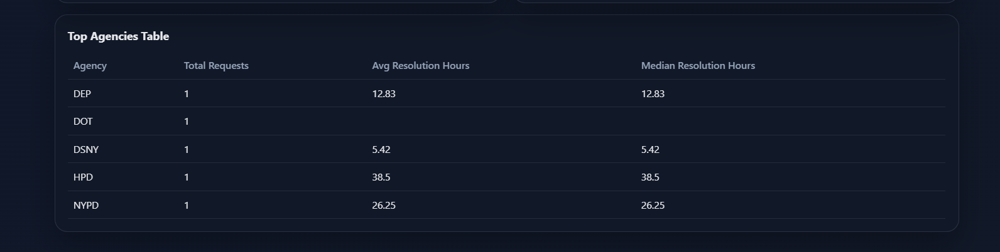
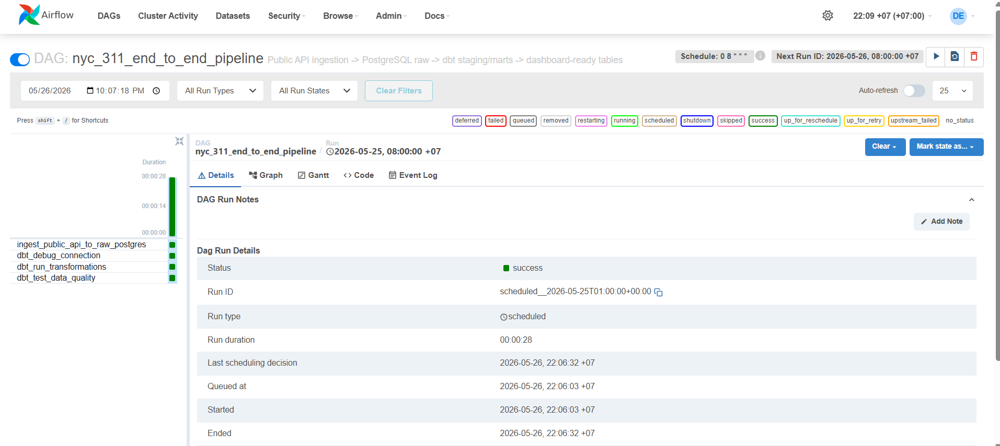
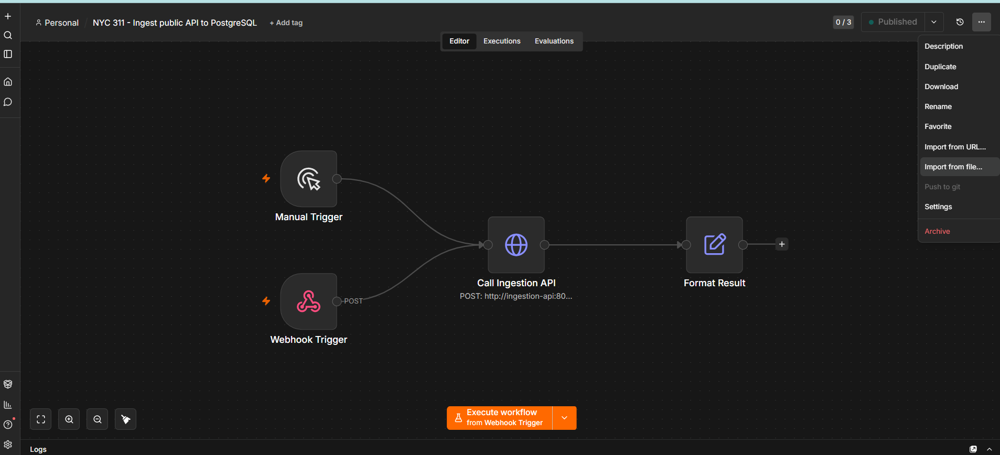

# NYC 311 Data Engineering Platform

An end-to-end **Data Engineering portfolio project** that ingests public civic service-request data, stores raw data in PostgreSQL, transforms it with dbt, orchestrates the pipeline in Airflow, and serves a dashboard web app with common analytical charts.

This project is designed to be opened in **Visual Studio Code** and started with **one Docker Compose file**.



## 1. Business Problem

NYC 311 receives non-emergency service requests from residents, including noise complaints, street conditions, sanitation issues, heating/hot water problems, and other operational incidents. The analytical goal is to build a reproducible data platform that helps answer:

- Which complaint types generate the highest workload?
- Which boroughs have the highest request volume?
- Which agencies handle the most requests?
- How fast are requests resolved?
- What is the daily trend of public service demand?

This is a practical Data Engineer project because it covers ingestion, raw data persistence, idempotent upsert, transformation, data quality tests, orchestration, and a dashboard-ready mart layer.

## 2. Public Data Source

- Source: **NYC Open Data — 311 Service Requests from 2020 to Present**
- API endpoint used by the pipeline: `https://data.cityofnewyork.us/resource/erm2-nwe9.json`
- Account/token: not required for normal demo usage. A Socrata app token can be added later through `SOCRATA_APP_TOKEN` if you need higher API limits.

The dataset is suitable for a portfolio project because it is public, continuously updated, and large enough to demonstrate scalable ELT design patterns.

## 3. Tech Stack

| Layer | Tool | Purpose |
|---|---|---|
| Public source | NYC Open Data Socrata API | Public JSON API, no account required |
| Workflow crawler | n8n | Preloaded workflow to trigger ingestion |
| Ingestion service | FastAPI + Python | Fetch API, normalize data, upsert into PostgreSQL |
| Storage | PostgreSQL | Airflow metadata DB and analytics DB |
| Transform | dbt-postgres | Build staging and mart models |
| Orchestration | Apache Airflow | End-to-end DAG scheduling and monitoring |
| Dashboard | FastAPI + Chart.js | Web dashboard over transformed mart tables |
| Runtime | Docker Compose | One-command local environment |

## 4. Repository Structure

```text
nyc311-data-engineering-platform/
├── dags/
│   └── nyc_311_end_to_end_pipeline.py
├── dbt/
│   ├── .dbt/profiles.yml
│   └── projects/nyc_311_analytics/
│       ├── dbt_project.yml
│       ├── macros/generate_schema_name.sql
│       └── models/
│           ├── sources.yml
│           ├── staging/stg_311_requests.sql
│           └── marts/*.sql
├── dashboard/
│   ├── app.py
│   └── requirements.txt
├── docker/
│   ├── airflow/Dockerfile
│   ├── ingestion/Dockerfile
│   └── dashboard/Dockerfile
├── docs/assets/architecture.svg
├── docs/assets/screenshots/*.png
├── ingestion/
│   ├── api.py
│   ├── ingest_nyc_311.py
│   └── sample_nyc_311.json
├── n8n/workflows/nyc311_ingestion_workflow.json
├── postgres/init/01_create_analytics.sql
├── docker-compose.yml
├── QUICKSTART.md
└── README.md
```

## 5. Data Flow

### Step 1 — Crawl public data

The ingestion script calls the NYC 311 Socrata API and fetches recent service requests using selected fields only. This keeps the pipeline efficient and avoids loading unnecessary columns.

### Step 2 — Persist raw data

Rows are inserted into `raw.nyc_311_service_requests` using an idempotent upsert on `unique_key`. Running the pipeline multiple times will update existing records instead of creating duplicates.

### Step 3 — Transform with dbt

The dbt project builds:

- `staging.stg_311_requests`: cleaned and typed service-request records.
- `marts.mart_daily_requests`: daily trend and closure metrics.
- `marts.mart_complaint_types`: top complaint types and average resolution time.
- `marts.mart_borough_complaints`: borough-level complaint mix.
- `marts.mart_status_summary`: request status distribution.
- `marts.mart_agency_performance`: agency workload and resolution metrics.
- `marts.mart_resolution_metrics`: resolution speed by borough.

### Step 4 — Validate quality

dbt tests validate important assumptions:

- `unique_key` is not null and unique.
- `created_date` is not null in staging.
- important dimensions such as `complaint_type`, `borough`, and `status` are populated.

### Step 5 — Visualize dashboard

The dashboard reads from the `marts` schema and displays:

- Total requests
- Closed requests
- Open/other requests
- Average resolution hours
- Daily volume trend
- Top complaint types
- Borough distribution
- Status distribution
- Agency workload
- Resolution hours by borough

## 6. Demo Screenshots

The screenshots below show the successful local run of the project: n8n workflow, Airflow DAG, and dashboard web application reading transformed dbt marts.

### 6.1 Dashboard — KPI and trend overview



### 6.2 Dashboard — borough, status, agency and resolution charts



### 6.3 Dashboard — top agencies table



### 6.4 Airflow — end-to-end DAG success



### 6.5 n8n — crawler workflow imported



## 7. How to Run

See [QUICKSTART.md](QUICKSTART.md) for the shortest runbook.

From Visual Studio Code terminal:

```bash
cd nyc311-data-engineering-platform
docker compose up --build -d
```

Open services:

| Service | URL | Credential |
|---|---|---|
| Airflow | http://localhost:8080 | airflow / airflow |
| n8n | http://localhost:5678 | disabled for local simplicity |
| Dashboard | http://localhost:8501 | none |
| Ingestion API | http://localhost:8000/health | none |
| PostgreSQL | localhost:5432 | airflow / airflow |

Check containers:

```bash
docker compose ps
```

Expected core containers:

```text
nyc311-postgres
nyc311-ingestion-api
nyc311-n8n
nyc311-airflow-webserver
nyc311-airflow-scheduler
nyc311-dashboard
```

## 8. Recommended Demo Flow: n8n → Airflow → Dashboard

Use this sequence when presenting the project in a CV/interview/demo.

### Step 1 — Start all services

```bash
docker compose up --build -d
```

Wait around 1–3 minutes for PostgreSQL, Airflow, n8n, and the dashboard service to become ready.

### Step 2 — Import or verify the n8n workflow

The project already mounts the workflow file at:

```text
n8n/workflows/nyc311_ingestion_workflow.json
```

The Docker Compose file also tries to import this workflow automatically when n8n starts:

```yaml
n8n import:workflow --input=/workflows/nyc311_ingestion_workflow.json || true
n8n start
```

If the workflow is already visible in n8n, you do not need to import it again. If it is not visible, import it manually:

1. Open n8n: `http://localhost:5678`
2. Go to **Workflows**.
3. Click the top-right **three-dot menu**.
4. Choose **Import from file**.
5. Select this local project file:

```text
n8n/workflows/nyc311_ingestion_workflow.json
```

6. Open the workflow named:

```text
NYC 311 - Ingest public API to PostgreSQL
```

7. Click **Execute workflow** from **Manual Trigger**.

The n8n workflow calls the internal ingestion service:

```text
POST http://ingestion-api:8000/ingest?limit=5000&allow_fixture_fallback=true
```

This demonstrates a visual crawler workflow that can fetch public data and push it into PostgreSQL through the reusable ingestion API.

### Step 3 — Run the Airflow DAG

Open Airflow:

```text
http://localhost:8080
```

Login:

```text
username: airflow
password: airflow
```

Run this DAG:

```text
nyc_311_end_to_end_pipeline
```

The DAG performs the full Data Engineering pipeline:

```text
ingest_public_api_to_raw_postgres
  -> dbt_debug_connection
  -> dbt_run_transformations
  -> dbt_test_data_quality
```

The DAG logic is:

1. Trigger ingestion from the NYC 311 public API into `raw.nyc_311_service_requests`.
2. Validate the dbt/PostgreSQL connection.
3. Run dbt models from staging to marts.
4. Run dbt tests to validate data quality.

You can override the ingestion size when triggering the DAG with config:

```json
{
  "limit": 10000,
  "days_back": 30
}
```

### Step 4 — Open the dashboard

Open the dashboard after the Airflow DAG succeeds:

```text
http://localhost:8501
```

The dashboard reads only from transformed dbt mart tables in the `marts` schema. It should show:

- KPI cards: total requests, closed requests, open/other requests, average resolution hours.
- Daily request volume trend.
- Top complaint types.
- Borough request distribution.
- Status distribution.
- Agency workload.
- Resolution hours by borough.
- Top agencies table.

## 9. n8n Workflow Details

The n8n workflow is intentionally simple and production-friendly:

```text
Manual Trigger / Webhook Trigger
  -> HTTP Request: Call Ingestion API
  -> Format Result
```

The workflow does not contain database credentials directly. Database writing is handled by the Python ingestion API, so the same ingestion logic can be called from:

- n8n for a visual crawler workflow.
- Airflow for scheduled orchestration.
- Manual API calls for debugging.

Manual API test from the host machine:

```bash
curl -X POST "http://localhost:8000/ingest?limit=1000&allow_fixture_fallback=true"
```

Inside Docker services, use the internal service URL:

```text
http://ingestion-api:8000
```

## 10. Database Schemas

| Schema | Purpose |
|---|---|
| `raw` | API data loaded with minimal transformation |
| `staging` | cleaned, typed, standardized records |
| `marts` | dashboard-ready aggregate tables |

Main raw table:

```sql
raw.nyc_311_service_requests
```

Primary key:

```sql
unique_key
```

Useful PostgreSQL check:

```bash
docker compose exec postgres psql -U airflow -d analytics -c "select count(*) from raw.nyc_311_service_requests;"
docker compose exec postgres psql -U airflow -d analytics -c "select * from marts.mart_daily_requests limit 5;"
```

## 11. Airflow Notes

The Airflow environment is configured with Vietnam timezone:

```text
Asia/Ho_Chi_Minh
```

Default login:

```text
username: airflow
password: airflow
```

Run DAG manually:

```bash
docker compose exec airflow-scheduler airflow dags trigger nyc_311_end_to_end_pipeline
```

Check DAG list:

```bash
docker compose exec airflow-scheduler airflow dags list | grep nyc_311
```

## 12. dbt Manual Commands

Run these commands if you want to test dbt without clicking Airflow:

```bash
docker compose exec airflow-scheduler bash -lc "cd /opt/airflow/dbt/projects/nyc_311_analytics && dbt debug --profiles-dir /opt/airflow/dbt/.dbt"

docker compose exec airflow-scheduler bash -lc "cd /opt/airflow/dbt/projects/nyc_311_analytics && dbt run --profiles-dir /opt/airflow/dbt/.dbt"

docker compose exec airflow-scheduler bash -lc "cd /opt/airflow/dbt/projects/nyc_311_analytics && dbt test --profiles-dir /opt/airflow/dbt/.dbt"
```

## 13. Troubleshooting

### Port already in use

Change the left-side port in `docker-compose.yml`, for example:

```yaml
ports:
  - "8085:8080"
```

Then access Airflow through:

```text
http://localhost:8085
```

### Rebuild from scratch

```bash
docker compose down -v
docker compose up --build -d
```

### Check ingestion logs

```bash
docker compose logs -f ingestion-api
```

### Check Airflow scheduler logs

```bash
docker compose logs -f airflow-scheduler
```

### Check n8n logs

```bash
docker compose logs -f n8n
```

### Check dashboard logs

```bash
docker compose logs -f dashboard
```

### n8n workflow is not visible

Import it manually:

```text
n8n/workflows/nyc311_ingestion_workflow.json
```

Then save and execute the workflow from **Manual Trigger**.

### Dashboard has no data

Run the Airflow DAG first:

```text
nyc_311_end_to_end_pipeline
```

Then refresh:

```text
http://localhost:8501
```

You can also check whether dbt mart tables contain data:

```bash
docker compose exec postgres psql -U airflow -d analytics -c "select count(*) from marts.mart_daily_requests;"
```

### API rate limit or network issue

The ingestion service has a fixture fallback enabled by default for local demo stability. If the public API is unreachable, the pipeline still loads a small sample so dbt and the dashboard can be tested. For strict real API mode, set this in `docker-compose.yml`:

```yaml
INGEST_ALLOW_FIXTURE_FALLBACK: "false"
```

## 14. CV Project Description

**NYC 311 Data Engineering Platform** — Built an end-to-end ELT platform that ingests public NYC 311 service-request data from a Socrata API, stores raw records in PostgreSQL with idempotent upsert logic, transforms data using dbt into staging and mart layers, validates data quality through dbt tests, orchestrates the workflow with Apache Airflow, and serves a dashboard web application for monitoring complaint trends, agency workload, borough distribution, and resolution performance.

Suggested CV bullet points:

- Built a Dockerized ELT platform using Airflow, dbt, PostgreSQL, n8n, FastAPI, and Chart.js to process public NYC 311 service-request data.
- Implemented idempotent API ingestion with PostgreSQL upsert logic, raw/staging/mart schema design, and dbt data quality tests.
- Integrated n8n as a visual crawler workflow and Airflow as the production orchestration layer for reproducible ELT scheduling.
- Designed dashboard-ready marts and a web dashboard to analyze daily request volume, top complaint types, agency workload, borough distribution, and resolution performance.
- Packaged the project into a single Docker Compose environment for reproducible local deployment and portfolio demonstration.
